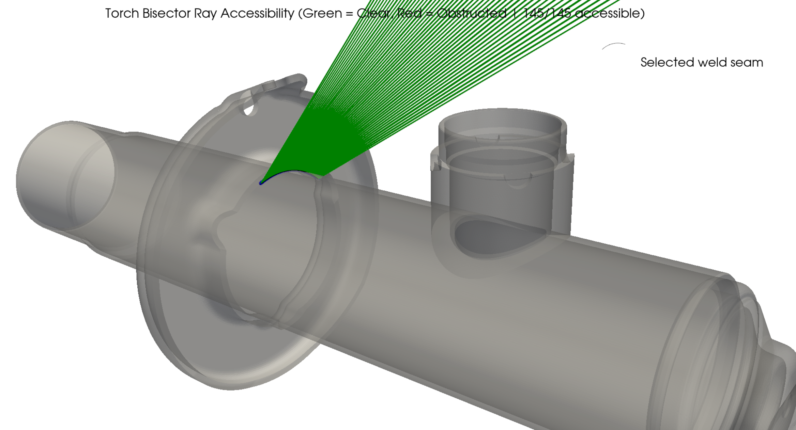
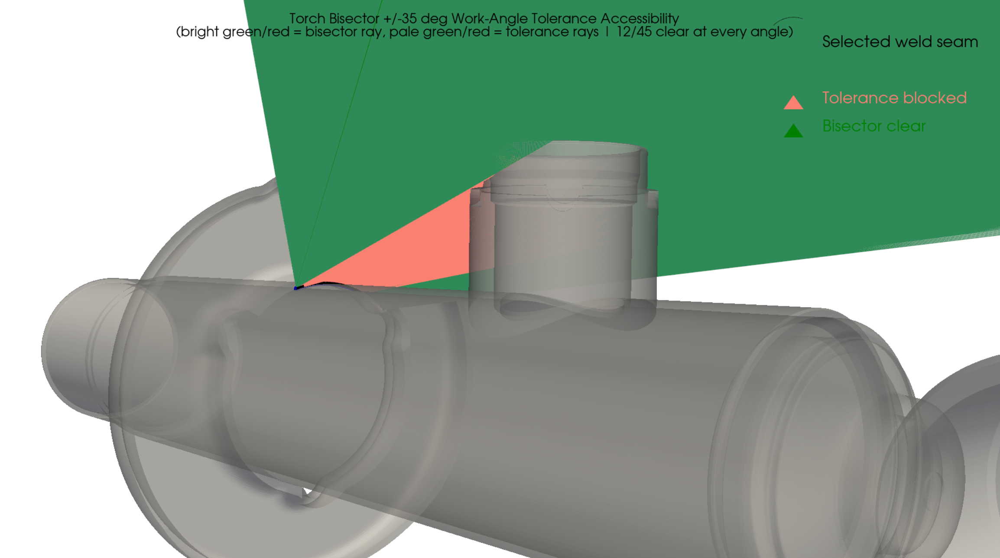
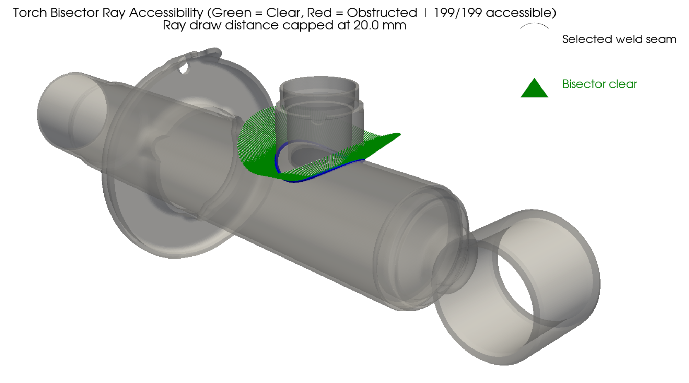
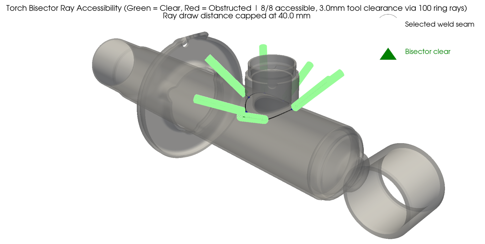
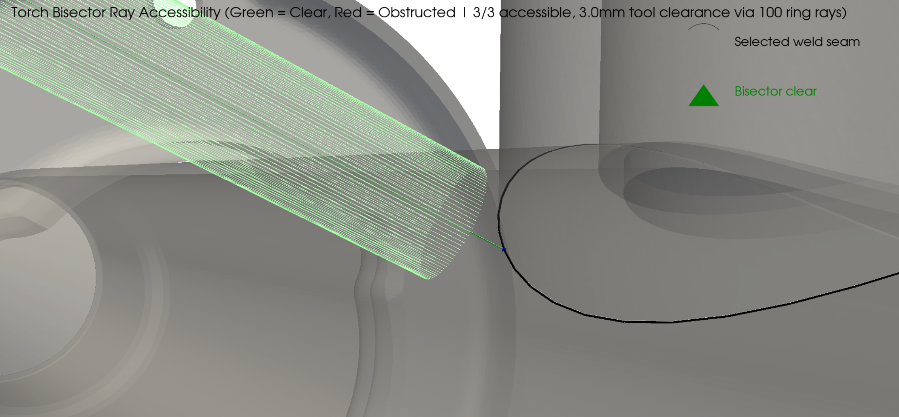
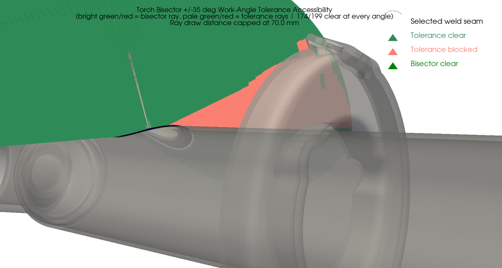
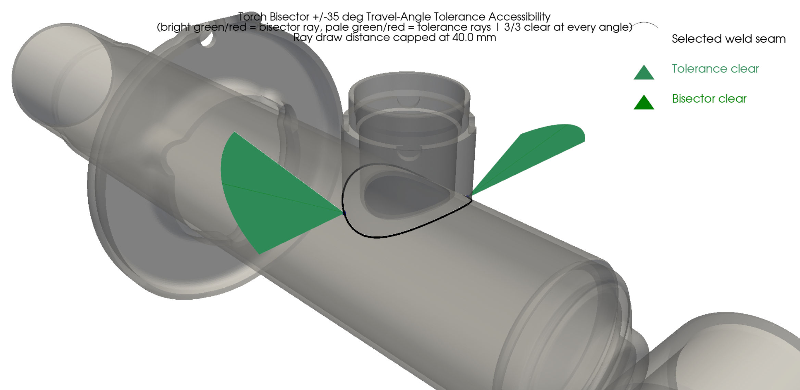

# Weld Joint Accessibility Analysis

Tools to check whether a welding torch can physically reach a weld seam on a 3D CAD part, given the surrounding geometry. You give it a STEP file and click two faces meeting at a joint; the pipeline finds the seam between them, samples points along it, computes the direction a torch should approach from (the bisector between the two faces), and casts rays along that direction to see what blocks the way. Results are shown in an interactive 3D view — green rays are clear, red rays are blocked.

The pipeline can also model the torch as having a real radius instead of an infinitely thin ray, and can test the torch held at an angle instead of the ideal bisector, since that's closer to how a torch is actually held in practice.




## Environment Setup

Needs Python 3.10 (required for pythonocc-core / NVIDIA Warp compatibility).

```bash
conda create -n weld_env python=3.10 -c conda-forge -y
conda activate weld_env
conda install -c conda-forge pythonocc-core pyvista numpy gmsh scipy -y
pip install warp-lang
```

An NVIDIA CUDA-capable GPU is used for ray casting. Warp can fall back to CPU if none is available, but it's much slower.

---

## Main Scripts

All four scripts below share the same workflow:

1. Load a STEP file (single part or assembly).
2. Left-click two adjacent faces in the interactive window — the two faces that meet at the joint to weld. Clicking a cylindrical face that STEP exported as several separate pieces automatically selects the whole group.
3. The weld seam between the two faces is found automatically. If they don't share real B-Rep topology (e.g. separate, just-touching assembly components), you're asked to pick the seam edge manually.
4. Points are sampled along the seam, rays are cast, and the result is shown (green = accessible, red = blocked), plus a text summary in the console.
5. After that window closes, you're asked if you want a second view of the same result with every ray drawn only up to a shorter distance you choose (in mm) — useful when the full-length rays (drawn out to the part's bounding-box diagonal) clutter the view. No rays are re-cast, just redrawn shorter.

### `weldfinal.py`

The base script — casts a single ray per point, straight along the bisector direction (equal angle from both faces).

```bash
python weldfinal.py --step part.stp
```

| Argument | Default | Description |
|---|---|---|
| `--step` | *required* | Path to the STEP file |
| `--num_samples` | 15 | Points sampled along the weld seam |
| `--near_tol` | 0.5 | Ray start offset (mm) — avoids false self-hits at the surface |
| `--minh` / `--maxh` | 0.5 / 3.0 | Gmsh min/max mesh element size (mm) |
| `--curvature` | 10 | Gmsh curvature-based mesh refinement factor |
| `--force_remesh` | off | Ignore the cached mesh and re-mesh from scratch |
| `--n_rings` | *(asked interactively)* | Clearance-ring rays per point, simulating a round tool tip. If not passed on the command line, you're asked at startup whether to enable it, and for the values below |
| `--clearance_radius` | 5.0 | Simulated tool radius in mm (only used with `--n_rings`) |
| `--ring_offset` | radius | Forward offset of the clearance rings from the seam point (mm) |


### `weldfinal_assembly.py`

Same as `weldfinal.py`, but for assemblies where the two components don't share real topology — each is its own separate solid, just placed touching the other. Adds a manual seam-edge picking step for that case. Same arguments as `weldfinal.py`.

```bash
python weldfinal_assembly.py --step assembly.stp
```





### `weld_angle_updown.py`

Same pipeline, but additionally casts two extra rays per point, tilted `--tol_deg` **up and down** from the bisector — i.e. within the joint's cross-section, toward one face or the other. This simulates the torch's *work angle* tolerance, which is naturally limited by the two flanking faces, hence the small default.

```bash
python weld_angle_updown.py --step part.stp --tol_deg 10
```

Same arguments as `weldfinal.py`, plus:

| Argument | Default | Description |
|---|---|---|
| `--tol_deg` | 10.0 | Up/down tilt tested on each side of the bisector (degrees) |
| `--angle_step` | off | If set, fills the whole ±`tol_deg` range with a ray every N degrees, instead of testing only the bisector and the two extremes |



### `weld_angle_leftright.py`

Same idea, but tilts `--tol_deg` **left and right** along the seam's travel direction instead of up/down. Simulates the torch's *travel angle* (push/drag), which tolerates a wider range than the work angle — hence the larger default.

```bash
python weld_angle_leftright.py --step part.stp --tol_deg 20
```

Same arguments as `weld_angle_updown.py` (default `--tol_deg` is 20.0 here instead of 10.0).



### `weld_debug_normals.py`

Diagnostic tool for when a joint's rays look wrong. Shows, per sample point, the surface normal read from each face, the resulting bisector, and the underlying mesh triangle's own normal for comparison — so you can see exactly where a normal or bisector direction goes wrong. Same picking flow and core arguments as `weldfinal.py` (no clearance-ring support).

```bash
python weld_debug_normals.py --step part.stp
```

---

## In Progress — Not Yet Working

> ⚠️ **Wrong output**

### `weld_line_finder.py`

Intended to automatically find every weld line between two chosen assembly components — scanning for candidate edges/loops near each other instead of requiring manual picking — for reuse by other scripts.

### `weld_sequence.py`

Intended to plan the *order* in which multiple weld joints across an assembly should be welded, so that welding one joint early doesn't block torch access to another joint welded later.

---
