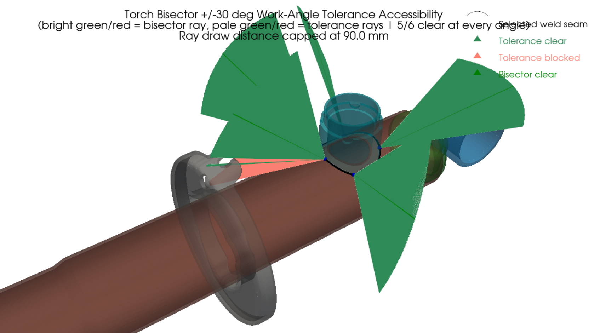
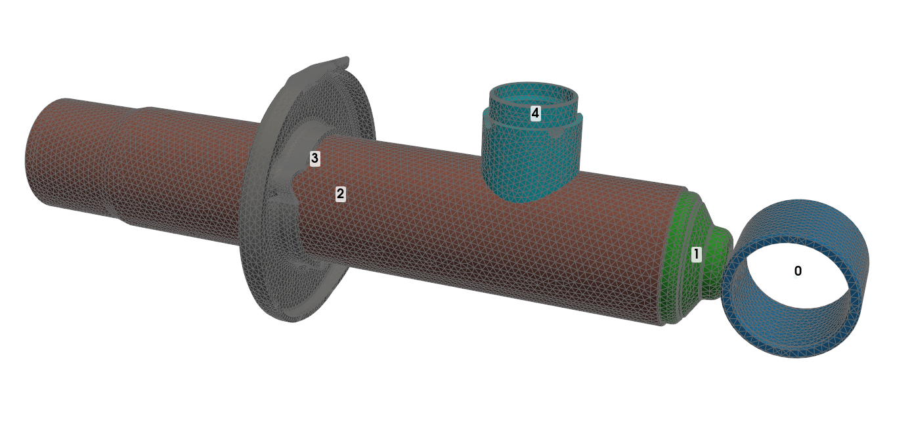
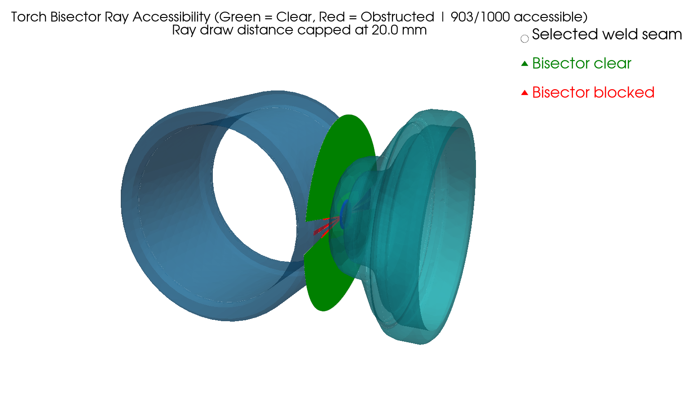
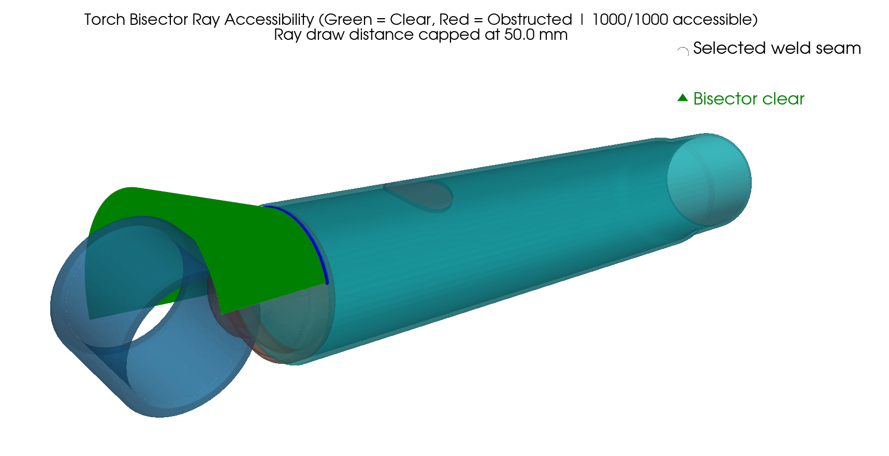
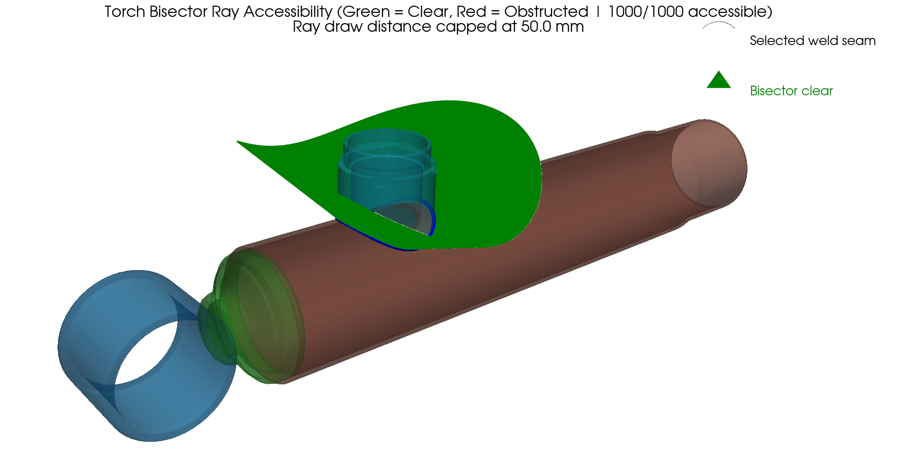
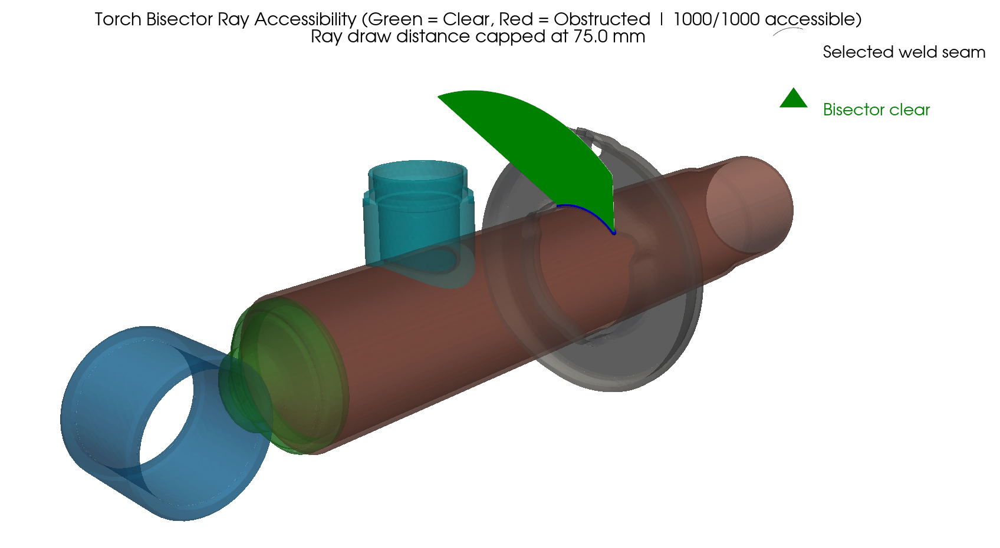
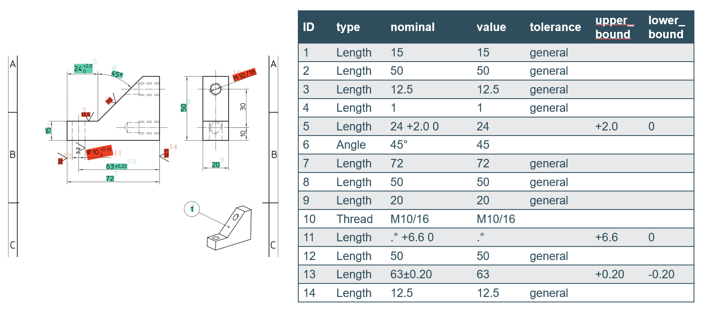
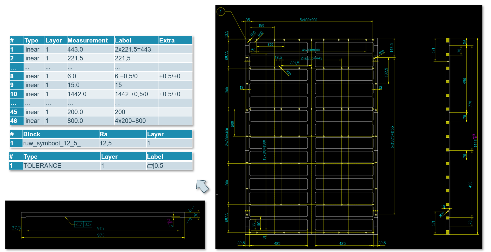

# Weld Accessibility Analysis

Tools to check whether a welding torch can physically reach a weld seam on a 3D CAD part, given the surrounding geometry. You give it a STEP file and click two faces meeting at a joint; the pipeline finds the seam between them, samples points along it, computes the direction a torch should approach from (the bisector between the two faces), and casts rays along that direction to see what blocks the way. Results are shown in an interactive 3D view — green rays are clear, red rays are blocked.

The pipeline can also model the torch as having a real radius instead of an infinitely thin ray, and can test the torch held at an angle instead of the ideal bisector, since that's closer to how a torch is actually held in practice.


## Environment Setup

Needs Python 3.10 (required for pythonocc-core / NVIDIA Warp compatibility).

```bash
conda create -n weld_env python=3.10 -c conda-forge -y
conda activate weld_env
conda install -c conda-forge pythonocc-core pyvista numpy gmsh scipy -y
pip install warp-lang
```

An NVIDIA CUDA-capable GPU is used for ray casting. Warp can fall back to CPU if none is available, but it's much slower.

---

## Main Scripts

The first five scripts below share the same click-based workflow:

1. Load a STEP file (single part or assembly).
2. Left-click two adjacent faces in the interactive window — the two faces that meet at the joint to weld. Clicking a cylindrical face that STEP exported as several separate pieces automatically selects the whole group.
3. The weld seam between the two faces is found automatically. If they don't share real B-Rep topology (e.g. separate, just-touching assembly components), you're asked to pick the seam edge manually.
4. Points are sampled along the seam, rays are cast, and the result is shown (green = accessible, red = blocked), plus a text summary in the console.
5. After that window closes, you're asked if you want a second view of the same result with every ray drawn only up to a shorter distance you choose (in mm) — useful when the full-length rays (drawn out to the part's bounding-box diagonal) clutter the view. No rays are re-cast, just redrawn shorter.

### `weldfinal.py`

The base script — casts a single ray per point, straight along the bisector direction (equal angle from both faces).

```bash
python weldfinal.py --step part.stp
```

| Argument | Default | Description |
|---|---|---|
| `--step` | *required* | Path to the STEP file |
| `--num_samples` | 15 | Points sampled along the weld seam |
| `--near_tol` | 0.5 | Ray start offset (mm) — avoids false self-hits at the surface |
| `--minh` / `--maxh` | 0.5 / 3.0 | Gmsh min/max mesh element size (mm) |
| `--curvature` | 10 | Gmsh curvature-based mesh refinement factor |
| `--force_remesh` | off | Ignore the cached mesh and re-mesh from scratch |
| `--n_rings` | *(asked interactively)* | Clearance-ring rays per point, simulating a round tool tip. If not passed on the command line, you're asked at startup whether to enable it, and for the values below |
| `--clearance_radius` | 5.0 | Simulated tool radius in mm (only used with `--n_rings`) |
| `--ring_offset` | radius | Forward offset of the clearance rings from the seam point (mm) |


### `weldfinal_assembly.py`

Same as `weldfinal.py`, but for assemblies where the two components don't share real topology — each is its own separate solid, just placed touching the other. Adds a manual seam-edge picking step for that case. Same arguments as `weldfinal.py`.

```bash
python weldfinal_assembly.py --step assembly.stp
```


### `weld_angle_updown.py`

Same pipeline, but additionally casts two extra rays per point, tilted `--tol_deg` **up and down** from the bisector — i.e. within the joint's cross-section, toward one face or the other. This simulates the torch's *work angle* tolerance, which is naturally limited by the two flanking faces, hence the small default.

```bash
python weld_angle_updown.py --step part.stp --tol_deg 10
```

Same arguments as `weldfinal.py`, plus:

| Argument | Default | Description |
|---|---|---|
| `--tol_deg` | 10.0 | Up/down tilt tested on each side of the bisector (degrees) |
| `--angle_step` | off | If set, fills the whole ±`tol_deg` range with a ray every N degrees, instead of testing only the bisector and the two extremes |



### `weld_angle_leftright.py`

Same idea, but tilts `--tol_deg` **left and right** along the seam's travel direction instead of up/down. Simulates the torch's *travel angle* (push/drag), which tolerates a wider range than the work angle — hence the larger default.

```bash
python weld_angle_leftright.py --step part.stp --tol_deg 20
```

Same arguments as `weld_angle_updown.py` (default `--tol_deg` is 20.0 here instead of 10.0).


### `weld_debug_normals.py`

Diagnostic tool for when a joint's rays look wrong. Shows, per sample point, the surface normal read from each face, the resulting bisector, and the underlying mesh triangle's own normal for comparison — so you can see exactly where a normal or bisector direction goes wrong. Same picking flow and core arguments as `weldfinal.py` (no clearance-ring support).

```bash
python weld_debug_normals.py --step part.stp
```

---

### `weld_line_finder.py`

A different picking workflow from the five scripts above, built for parts/assemblies with many weld lines where clicking exact faces is slow or unreliable (thin edges, tightly packed geometry). Works on both single-body parts and assemblies — auto-detected from the STEP file — with the *same* interactive flow either way:

1. Load the STEP file. Every real edge (single-body: edges separating two distinct faces; assembly: every edge of every component) is drawn once with a numbered label, colored per edge.
2. Instead of clicking, you type the edge ID(s) for one weld line in the terminal — a single ID, or comma-separated IDs if it's several connected pieces forming one continuous seam (a straight run, or a loop). IDs that don't form a single connected chain are rejected with an explanation, not silently split. Type `show` to redisplay the numbered edges, or leave it blank once you're done picking weld lines for this run.
3. **Single-body mode**: both faces adjacent to each picked edge are already known exactly from the part's own B-Rep topology — no further input needed.
   **Assembly mode**: separate components share no B-Rep topology, so only the *edge's own* side is known for certain that way. For each weld line you pick, you're asked once which *other* component it's welded to; the matching face on that component is then found automatically by spatial proximity (within `--proximity_tol`), or you're shown the closest candidates to pick from if the match isn't clean. An edge that already has two faces on its own component (an ordinary corner, e.g. any edge of a plain box) additionally goes through a parallel-normal test against the resolved far face, to drop whichever of its two candidate faces turns out to be the hidden, flush contact face rather than the real exposed joint face.
4. Points are sampled along the seam — proportioned by each piece's real arc length, not split evenly per piece, so a long straight run gets more points than a short curved one — normals and the bisector are computed per point (with full debug output printed per point: coordinates, both normals and how each was resolved, the angle between them, the bisector), and you get a 3D preview to confirm before it's kept.
5. Repeat for as many weld lines as the part has, then optionally run the full ray-cast accessibility check (same green/red visualization as the scripts above) on all of them, each treated as a single group even when made of several pieces.

```bash
python weld_line_finder.py --step part_or_assembly.stp
```

| Argument | Default | Description |
|---|---|---|
| `--step` | *required* | Path to the STEP file (single solid or assembly) |
| `--num_samples` | 15 | Points sampled along each weld line (split across its pieces by arc length) |
| `--near_tol` | 0.5 | Ray start offset (mm), used if you run the ray-cast check at the end |
| `--proximity_tol` | 2.0 | Assembly mode only: max distance (mm) for a face on the chosen other component to be accepted as a weld line's far-side face |
| `--parallel_tol_deg` | 20.0 | Assembly mode only: an own-side candidate face within this many degrees of parallel to the resolved far-side face is treated as the hidden flush-contact face and eliminated |
| `--minh` / `--maxh` | 0.5 / 3.0 | Gmsh min/max mesh element size (mm) |
| `--curvature` | 10 | Gmsh curvature-based mesh refinement factor |
| `--force_remesh` | off | Ignore the cached mesh and re-mesh from scratch |

### `weld_sequence.py`

Assembly-only (errors out on a single-body part — use `weld_line_finder.py` for that). Reuses `weld_line_finder.py`'s entire picking flow unchanged to collect every weld line you want across the assembly, then searches for the best *order* to weld them in.

The idea: a part that hasn't been welded on yet isn't necessarily physically present to block the torch for an *earlier* joint, but once a part is introduced by any weld, it stays present for every joint after it. So testing joint A-B before C exists gives a different (often more favorable) accessibility result than testing it after C is already welded in place. Components that aren't the target of any weld line you picked are treated as fixed context, present from the start.

Once you confirm the picked weld lines, it evaluates every possible weld order (or, past `--max_full_enum` weld lines, finds the provably-best order for total blocked rays via an exact subset search instead of brute-force, since the factorial blow-up stops being practical to enumerate one by one). A weld line that had to be entered as several disconnected pieces (see step 2 above) is judged as one joint: it only counts as "fully accessible" if *every* one of its pieces ends up unblocked, not each piece separately. Priority 1 is the number of whole joints that come out fully accessible; priority 2 (tiebreak) is the total number of blocked rays across everything. Full per-order results are printed, plus a ranked summary table comparing every order against the optimal one.

```bash
python weld_sequence.py --step assembly.stp
```

Same arguments as `weld_line_finder.py`, plus:

| Argument | Default | Description |
|---|---|---|
| `--max_full_enum` | 8 | Max weld lines to brute-force enumerate every ordering for (exact search on both priorities, full per-order report). Above this, falls back to a subset-DP search that only guarantees minimizing total blocked rays |







### `weld_sequence_from_docx.py`

Same weld-order search as `weld_sequence.py`, but the weld lines are read from a `.docx` instead of being picked by hand: one line per weld, as comma-separated edge IDs (the numbers `weld_line_finder.py` shows), optionally followed by the component it is welded onto (`70,71,72,73:3`, or `:auto` to detect it from proximity). Prompts for sample count, clearance rings and a manual tilt angle, prints only the final ranked table (also saved to a text log), and shows the step-by-step ray-cast views with rays capped at 100 mm.

```bash
python weld_sequence_from_docx.py --step Assem2.STEP --docx Assem2.docx
```

### `debug_face_edges.py`

Debug viewer: shows the assembly with numbered components, isolates the one you pick, and lets you click a face to label only that face's edges with their candidate-edge IDs (the same numbers used in the docx).

```bash
python debug_face_edges.py --step Assem2.STEP
```

---
## Drawing Availability
### PDF

### DXF

---
## To Be Implemented in the Future

`weld_sequence.py`'s ordering search currently only tests the ideal bisector ray per sample point — a point is "blocked" or "clear" with no in-between, even though `weld_angle_updown.py` / `weld_angle_leftright.py` already show that tilting the torch off the bisector is often possible and sometimes the only way to actually reach a joint. Planned next steps, in order:

1. **Tilt search for blocked rays.** When a bisector ray comes out blocked during the sequence search, sweep the same up/down (work angle) and left/right (travel angle) tilts already used elsewhere in the pipeline to check whether some still-practical torch angle clears the obstruction, instead of just recording the bisector result as pass/fail.
2. **Least-blocked-rays search with minimum tilt from the bisector.** Rather than a fixed tilt sweep, search for the smallest angular deviation from the ideal bisector (in either axis) that clears each blocked point, so a weld order can be judged not just by how many points are blocked outright, but by how many still need a real tilt away from the ideal angle to be reachable at all, and by how much.
3. **Automatic weld-line detection.** Remove manual edge picking entirely: identify which faces of each component are hidden/mating (versus exposed) and which edges sit at zero distance from a face belonging to a *different* component than the edge's own, to auto-discover every real weld line on an assembly instead of requiring them to be picked by hand in `weld_line_finder.py`.
4. **Full automatic welding analysis.** Combine all of the above into one end-to-end pipeline: detect every weld line automatically, then search weld order and torch angle together for the whole assembly, with no manual input beyond loading the STEP file.

---
